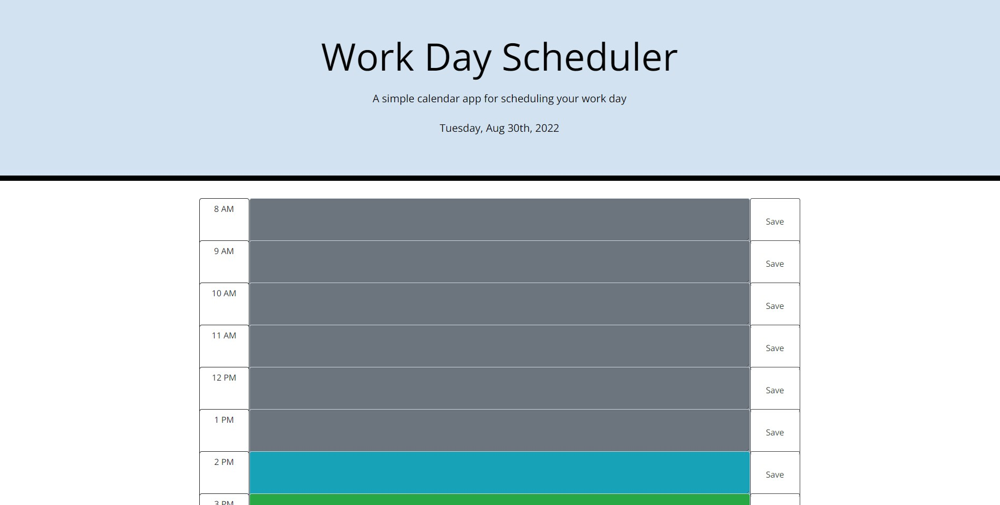

# Daily Professional Planner

## Description

This daily work planner allows the user to write down and save their schedule for each new work day. By clicking on the save button to the left of the chosen time block, the scheduled events will persist in the time block until they are revised at a later time. This can help the user with time management, remembering important meetings or other events, and help ensure that they accomplish all they set out to do each day. This web application was built using HTML, CSS, and Javascript, along with API's including Bootstrap, JQuery, and Moment.js.

## Link to Planner

[Daily Professional Planner](https://autumnlegere.github.io/dailyprofessionalplanner/)

## Screenshot

This is a screenshot of the web page.

Enjoy!
